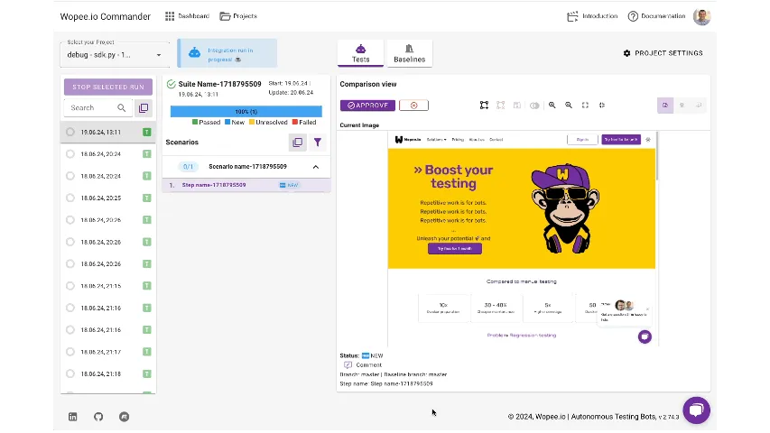

This is anThis might be a good place to start with Wopee.io and Cypress visual testing. Our template project provides you with a ready-to-use setup for visual testing with Cypress and Wopee.io. Also you will find a demo test that you can run to see how it works.

## Prerequisites

- [Node.js](https://nodejs.org/en/download/)
- Visual Studio Code or any other code editor
- Wopee.io [account](https://cmd.wopee.io)

## Environment setup

### Set Wopee.io API key

Before running the visual test, set up your API key as an environment variable named `WOPEE_API_KEY`.
You may set it from the command line like this:

=== "Linux/MacOS"

    ```shell
    export WOPEE_API_KEY=your-api-key
    ```

=== "Windows"

    ```shell
    set WOPEE_API_KEY=your-api-key
    ```

### Set `.env` file params

Template repository comes with sample environment file. You can easily reuse it and set your own `.env` file. To do so copy or rename `.env.example` file into `.env`.

All parameters are already set in `.env.example` file. You need to set only `WOPEE_PROJECT_UUID` parameter.

??? tip "Where to find project UUID and Wopee.io API key?"

    You can find your project UUID and Wopee.io API key in the project settings screen after navigating to project.

    

## Get template project

Clone repository using VS Code palette option (Ctrl + Shift + P): `https://github.com/Wopee-io/cypress-template` or by running:

    git clone https://github.com/Wopee-io/cypress-template

## Install dependencies

Install all dependencies:

    npm i

## Run tests

Run first demo test:

    npx cypress run --spec cypress/e2e/*.spec.ts

OR just:

    npm t

!!! note

    When running tests with the `npm t` command, ensure the API key is properly configured in the `.env` file.
    If using the `npx cypress run --spec cypress/e2e/*.spec.ts` command, the API key is read from an environment variable."

You can also run tests in Docker container (Docker need to installed on your machine):

    npm run tests-in-docker
