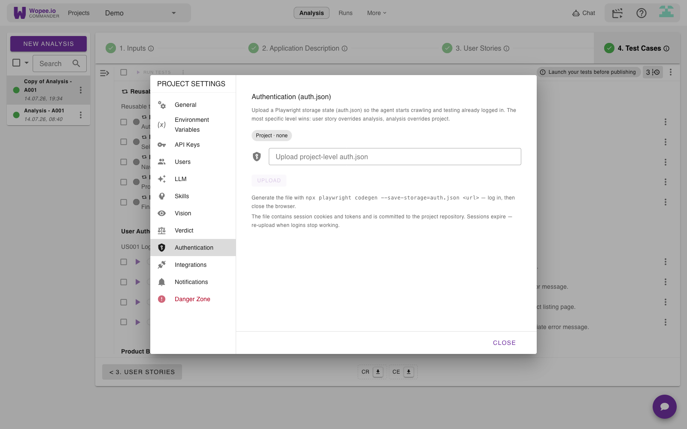
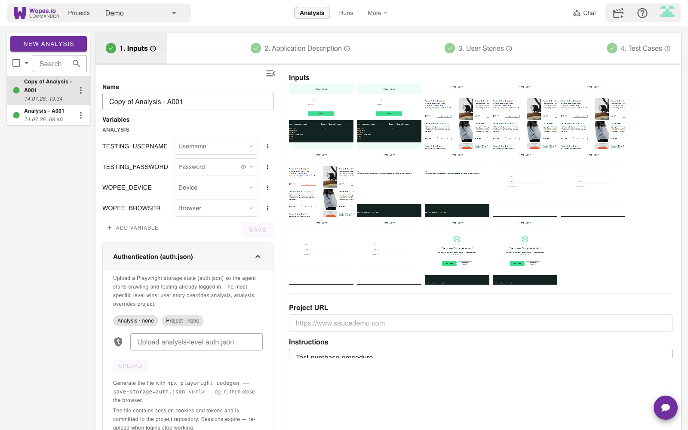
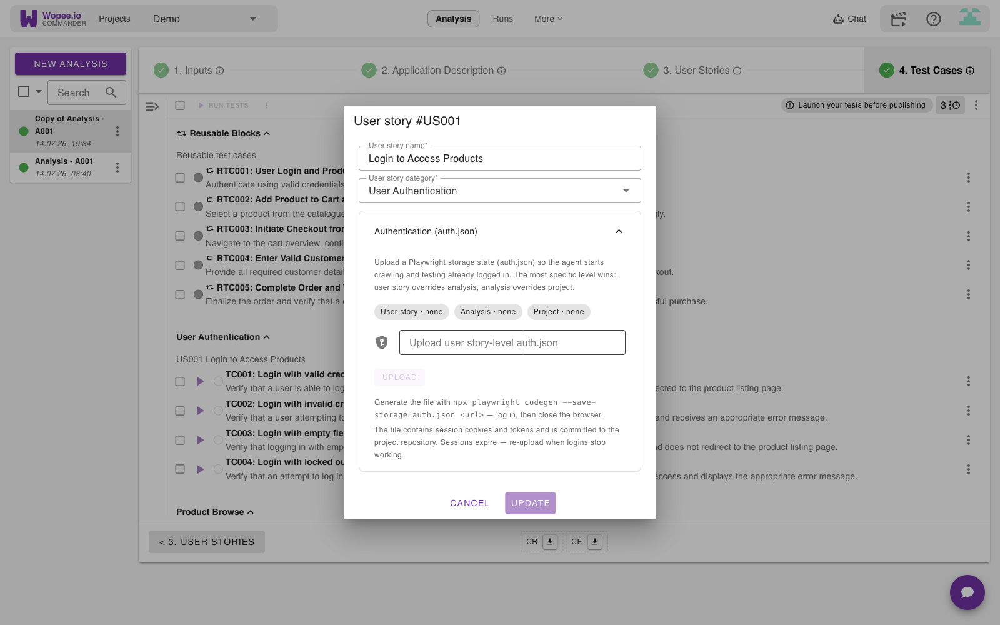

# 🗄️ Browser local storage

Configure and upload browser local storage data to ensure your tests run with the necessary application state and user preferences.

## Overview

Browser local storage is crucial for testing web applications that rely on client-side data persistence. Wopee.io allows you to upload and configure local storage data that will be available during test execution, ensuring tests run with realistic application states.

## What is browser local storage?

Local storage is a web storage mechanism that allows web applications to store data locally within a user's browser. This data includes:

- **User preferences**: Theme settings, language choices, display options
- **Authentication tokens**: Session tokens, API keys, refresh tokens
- **Application state**: Shopping cart contents, form data, user progress
- **Cache data**: Frequently accessed information, user-specific configurations

## How to obtain browser storage data

To capture browser storage data for your tests, you'll use Playwright's built-in test generator (`codegen`) tool. This tool allows you to record your browser interactions and automatically save the resulting storage state.

### Step 1: Install Playwright (if not already installed)

```bash
npm install -D @playwright/test
```

### Step 2: Generate storage state using Playwright codegen

Use the `codegen` command with the `--save-storage` flag to capture browser storage:

```bash
npx playwright codegen --save-storage=auth.json [your-website-url]
```

**Examples:**

```bash
# For a specific website
npx playwright codegen --save-storage=auth.json https://example.com

# For local development
npx playwright codegen --save-storage=auth.json http://localhost:3000

# Without URL (you can navigate manually)
npx playwright codegen --save-storage=auth.json
```

### Step 3: Authenticate and interact with your application

When the browser window opens:

1. **Navigate to your application** (if not already there)
2. **Perform authentication** (login, etc.)
3. **Navigate through pages** you want to test
4. **Interact with features** that set storage data
5. **Stop recording** by closing the browser window or pressing the stop button

### Step 4: Verify the generated file

After closing the browser, verify that `auth.json` was created in your current directory. The file should contain your browser's storage state including cookies, localStorage, sessionStorage, and IndexedDB data.

### Step 5: Provide the file to Wopee.io

Once you have your `auth.json`, hand it to Wopee.io in one of two ways:

- **Upload it in Commander (recommended)** — no repository work needed. See
  [How to upload auth.json in Commander](#how-to-upload-authjson-in-commander) below.
- **Commit it to your repository** — move the file to your repository's `data` directory:

```bash
mkdir -p data
mv auth.json data/
```

### Complete workflow example

Here's a complete example for capturing authentication state:

```bash
# 1. Start codegen with storage saving
npx playwright codegen --save-storage=auth.json https://myapp.com

# 2. In the browser window that opens:
#    - Navigate to the login page
#    - Enter your credentials
#    - Complete the login process
#    - Navigate to a few key pages
#    - Close the browser

# 3. Move the file to your repository
mkdir -p data
mv auth.json data/

# 4. Verify the file structure
ls -la data/auth.json
```

### Advanced codegen options

You can customize the codegen process with additional options:

```bash
# Emulate specific device
npx playwright codegen --device="iPhone 13" --save-storage=auth.json https://cmd.wopee.io

# Set specific viewport size
npx playwright codegen --viewport-size="1920,1080" --save-storage=auth.json https://cmd.wopee.io

# Emulate dark mode
npx playwright codegen --color-scheme=dark --save-storage=auth.json https://cmd.wopee.io

# Use existing browser profile (for persistent authentication)
npx playwright codegen --user-data-dir=/path/to/browser/profile --save-storage=auth.json https://cmd.wopee.io
```

### Testing the captured storage state

Before using the file in your tests, verify it works correctly:

```bash
# Test the captured authentication state
npx playwright codegen --load-storage=auth.json https://myapp.com
```

If the storage state is correct, you should see your application in an authenticated state when the browser opens.

### Troubleshooting storage capture

**Common issues and solutions:**

- **No file generated**: Ensure you close the browser window properly or stop recording
- **Empty file**: Make sure you actually perform actions that set storage data
- **Missing data**: Navigate through more pages and interact with features that use storage
- **Authentication not captured**: Complete the full login flow before stopping recording

**File size considerations:**

- Consider cleaning up unnecessary storage entries
- Focus on essential authentication and state data

## How to upload auth.json in Commander

The easiest way to provide your `auth.json` is to upload it directly in Commander — no repository work needed. The agent then starts **both crawling and test execution already logged in**.

You can upload the file at three levels. The **most specific level wins**: a user story overrides its analysis, and an analysis overrides the project.

```text
User story   (most specific)  ──▶  overrides analysis and project
Analysis                      ──▶  overrides project
Project      (broadest)       ──▶  applies everywhere by default
```

Uploading requires project-admin rights. If the **Upload** button is greyed out, ask your project admin.

!!! info "Where each file is stored"

    Each upload is committed to your project repository: the project level to `data/auth.json`, the analysis level to `data/auth.json` on the analysis branch, and the user story level to `data/US00x/auth.json` on the analysis branch. You normally don't need to touch these files by hand.

### Project level

Applies to **every** analysis and run in the project. Open **Project Settings → Authentication** and upload your `auth.json`.



### Analysis level

Applies to a **single analysis**, overriding the project-level file. Open the analysis **1. Inputs** panel and expand the **Authentication (auth.json)** section.



### User story level

Applies to a **single user story**, overriding both the analysis and project files. Open the user story's edit dialog (the pencil icon in **4. Test Cases**) and expand its **Authentication (auth.json)** section.



The status chips on each panel show which levels currently have a file and when each was uploaded, so you can see exactly which one the agent will use.

!!! warning "Sessions expire"

    `auth.json` contains live session cookies and tokens. When logins stop working, re-capture the file (repeat the steps above) and re-upload it — the new file replaces the old one.

## Supported storage types

Wopee.io AI Agent automatically loads data from the `data` directory. It is based on Playwright's [browser context](https://playwright.dev/docs/test-state#browser-context) and supports multiple browser storage mechanisms:

### localStorage

Key-value pairs stored persistently in the browser.

### sessionStorage

Temporary storage that lasts for the duration of the page session.

### Cookies

Small pieces of data stored by the browser for specific domains.

### IndexedDB

More complex database storage for larger amounts of structured data.

## Alternative: commit the file to your repository

Instead of [uploading in Commander](#how-to-upload-authjson-in-commander), you can commit the browser context file to your repository's `data` directory by hand. The AI testing agent will automatically detect and apply this storage state.

The same cascade applies, based on where you place the file:

| Level      | Path                    | Branch          |
| ---------- | ----------------------- | --------------- |
| Project    | `data/auth.json`        | default branch  |
| Analysis   | `data/auth.json`        | analysis branch |
| User story | `data/US00x/auth.json`  | analysis branch |

!!! note "Check it in Commander"

    Once the file is committed to the correct path and branch, it also shows up in the matching **Authentication (auth.json)** panel in Commander — the status chips there confirm the level is picked up. If it doesn't appear, double-check the path and branch against the table above.

Create a file named `auth.json` in your `data` directory (example):

```json
{
  "cookies": [
    {
      "name": "session-username",
      "value": "standard_user",
      "domain": "www.saucedemo.com",
      "path": "/",
      "expires": 1752609084,
      "httpOnly": false,
      "secure": false,
      "sameSite": "Lax"
    }
  ],
  "origins": [
    {
      "origin": "https://www.saucedemo.com",
      "localStorage": [
        {
          "name": "backtrace-guid",
          "value": "b6ff9051-63fb-49f5-9ce9-7706db9c4960"
        },
        {
          "name": "backtrace-last-active",
          "value": "1752608467035"
        }
      ]
    }
  ]
}
```

## File organization in your repository

### Repository structure

Place your browser context files in the `data` directory of your repository:

```
your-repository/
├── data/
│   └── auth.json          # Authentication context
├── tests/
└── src/
```

### Naming conventions

- Use file name: `auth.json`
- The agent automatically loads the the JSON file

## Storage data formats

### Origin-based localStorage format

The recommended format organizes storage by domain origin:

```json
{
  "origins": [
    {
      "origin": "https://cmd.wopee.io",
      "localStorage": [
        {
          "name": "user_id",
          "value": "12345"
        },
        {
          "name": "settings",
          "value": "{\"theme\": \"dark\", \"notifications\": true}"
        }
      ]
    }
  ]
}
```

### Cookies configuration

Cookies are specified in an array with detailed properties:

```json
{
  "cookies": [
    {
      "name": "auth_session", // Cookie name
      "value": "encrypted_session_data", // Cookie value
      "domain": ".cmd.wopee.io", // Domain scope
      "path": "/", // Path scope
      "expires": 1752609084, // Unix timestamp
      "secure": true, // HTTPS only
      "httpOnly": false, // JavaScript accessible
      "sameSite": "Lax" // SameSite policy
    }
  ]
}
```

### IndexedDB data

Complex structured data for IndexedDB:

```javascript
{
  "databases": [
    {
      "name": "MyAppDB",
      "version": 1,
      "stores": [
        {
          "name": "users",
          "data": [
            {"id": 1, "name": "John Doe", "email": "john@example.com"},
            {"id": 2, "name": "Jane Smith", "email": "jane@example.com"}
          ]
        }
      ]
    }
  ]
}
```

## Using storage data in tests

### Automatic detection and application

When you commit a JSON context file to your repository's `data` directory:

1. **Automatic detection**: The AI agent scans the `data` directory for JSON files during test initialization
2. **Context loading**: When found, the agent logs "Browser storage state found and to be uploaded"
3. **Browser initialization**: A new browser context is created with the pre-configured storage state
4. **State persistence**: All cookies, localStorage, and sessionStorage remain available throughout the test session
5. **Cross-domain support**: Storage data is applied per origin, supporting multi-domain applications

This seamless integration means tests automatically start with your configured authentication, user preferences, and application state.

### Practical example: Setting up authentication

1. **Create the context file**: Add `auth.json` to your `data` directory:

```json
{
  "cookies": [
    {
      "name": "session-username",
      "value": "standard_user",
      "domain": "www.saucedemo.com",
      "path": "/",
      "expires": 1752609084,
      "httpOnly": false,
      "secure": false,
      "sameSite": "Lax"
    }
  ],
  "origins": [
    {
      "origin": "https://www.saucedemo.com",
      "localStorage": [
        {
          "name": "user-session",
          "value": "authenticated"
        },
        {
          "name": "user-role",
          "value": "standard"
        }
      ]
    }
  ]
}
```

2. **Run your tests**: The AI agent will automatically detect this file and initialize the browser with this authentication state

3. **Tests start authenticated**: Your tests begin as if the user is already logged in, skipping login steps

## Common use cases

### Authentication testing

Pre-configure authentication tokens and user sessions:

```json
{
  "localStorage": {
    "access_token": "eyJhbGciOiJIUzI1NiIsInR5cCI6IkpXVCJ9...",
    "refresh_token": "def456ghi789jkl012mno345pqr678stu901",
    "user_profile": "{\"id\": 123, \"role\": \"admin\", \"permissions\": [\"read\", \"write\"]}"
  },
  "cookies": [
    {
      "name": "session_id",
      "value": "secure_session_hash",
      "domain": ".myapp.com",
      "secure": true,
      "httpOnly": true
    }
  ]
}
```

### E-commerce testing

Set up shopping cart and user preferences:

```json
{
  "localStorage": {
    "shopping_cart": "{\"items\": [{\"product_id\": 456, \"quantity\": 2, \"price\": 29.99}], \"total\": 59.98}",
    "user_preferences": "{\"currency\": \"USD\", \"shipping_address\": \"123 Main St\"}",
    "recently_viewed": "[456, 789, 123, 654]",
    "wishlist": "[789, 321, 555]"
  }
}
```

### Application state testing

Configure complex application states:

```json
{
  "localStorage": {
    "app_state": "{\"current_page\": \"dashboard\", \"sidebar_collapsed\": false}",
    "user_settings": "{\"theme\": \"dark\", \"language\": \"en\", \"timezone\": \"UTC\"}",
    "feature_flags": "{\"beta_ui\": true, \"advanced_features\": false}",
    "cache_timestamp": "2024-01-15T10:30:00Z"
  },
  "sessionStorage": {
    "form_data": "{\"step\": 3, \"completed_steps\": [1, 2]}",
    "temp_calculations": "{\"total\": 1250.50, \"tax\": 125.05}"
  }
}
```

## Best practices

!!! tip "Local storage best practices"

    - **Data consistency**: Ensure storage data matches your application's expected format
    - **Token validity**: Use valid, non-expired authentication tokens
    - **Minimal data**: Include only necessary data to avoid bloating
    - **Security**: Avoid real user credentials in test storage data
    - **Versioning**: Maintain different storage configurations for different test scenarios

## Environment-specific configurations

### Development environment

```json
{
  "localStorage": {
    "api_endpoint": "https://dev-api.myapp.com",
    "debug_mode": "true",
    "log_level": "debug"
  }
}
```

### Staging environment

```json
{
  "localStorage": {
    "api_endpoint": "https://staging-api.myapp.com",
    "debug_mode": "false",
    "log_level": "info"
  }
}
```

### Production-like testing

```json
{
  "localStorage": {
    "api_endpoint": "https://api.myapp.com",
    "debug_mode": "false",
    "log_level": "error"
  }
}
```

## Troubleshooting

### Storage not applied

- Verify JSON format is valid
- Check that domain settings match your application
- Ensure storage keys match application expectations

### Authentication issues

- Validate token format and expiration
- Check cookie domain and path settings
- Verify authentication flow compatibility

### Data format errors

- Ensure nested JSON is properly escaped
- Validate data types match application requirements
- Check for special characters in values

### Performance issues

- Reduce storage data size if tests are slow
- Avoid large IndexedDB datasets
- Clean up unnecessary storage entries

!!! warning "Security considerations"

    - Never use real user credentials in test storage data
    - Avoid storing sensitive information in plain text
    - Use test-specific tokens and session data
    - Regularly rotate test authentication data

!!! note "Need help?"

    For browser storage configuration issues, contact our support team at [help@wopee.io](mailto:help@wopee.io) or visit our [community discussions](https://github.com/orgs/Wopee-io/discussions).
